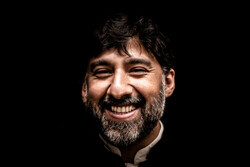

# User Personas

## Tree lover

<!-- some introduction -->

<!-- a persona -->

## Role

- **Bio**: Angelo is 27 years old, he is from Belgium and he loves to protect
  the nature.
- **Quotes**: Take me to the world of the nature and let me discover all about
  trees"
- **Needs/Goals**: Angelo loves trees that s why he visits ,any websites to find
  a lot of information about trees.

- **Frustrations**: Angello loves trees but his problem is that other website
  are more complex for him to understand but our website is simple to
  understand.

- **Scenario 1**: Angelo loves nature and he visits alot of websites because he
  likes to know more information about trees.

## Teacher

<!-- some introduction -->

<!-- a persona -->

## Their Role

- **Bio**: Peter is 50 years old teacher , he is from Germany and he teaches
  Biology at university of Munich.
- **Needs/Goals**: Peter loves Biology and he is looking for information about
  trees for his students.

- **Frustrations**: Peter loves to look for information about trees and nature
  but his problem is that other websites have many other information that do not
  collerate with the subject. Our website is easy to understand and has all the
  study material required by Peter.

- **Scenario 1**: Peter is a teacher and loves Biology and nature he visits alot
  of websites because he likes to know more information about trees for his
  students.

---

<!-- more personas ... -->
